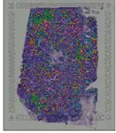
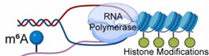

<h1 align="center">
Welcome to My Homepage! 
</h1>

  <b>Turning biological data and computational insight into solutions that drive better decisions.</b>

🤖 Machine Learning & AI • 🧬 Life Sciences Expertise • 📦 Pipeline Development • 🛠️ Computational Workflow Engineering  

✨ Senior Computational Biologist @ <a href="https://labs.utsouthwestern.edu/bioinformatics-lab">McDermott Center Bioinformatics Lab</a>

---

🔬 **Domain expertise:** Genomics, transcriptomics, proteomics, biomarker discovery, and broader life sciences.  

📊 **Technical toolkit:** Python, R, machine learning, generative AI, statistics, experimental design, and reproducible research.  

💪 **Strengths:** Detail-oriented, strong cross-functional collaborator, and execution-focused problem solver.  

---

## About Me

Computational biologist with 9+ years of experience in large-scale genomic data analysis, single-cell and multi-omics integration, and machine learning–driven discovery. I specialize in designing reproducible, scalable pipelines for next-generation sequencing, variant discovery, and transcriptomic analysis across human and model systems.

I combine a strong background in computer science, algorithm design, and statistical modeling with deep domain expertise in complex biological systems. I’m passionate about building robust workflows, de-risking analyses, and turning noisy data into actionable insight.

I prioritize mentoring junior team members and partnering effectively with senior scientists and stakeholders, fostering a collaborative culture that elevates team performance and accelerates impact. I’m always open to new opportunities and conversations about how my skills can add value to your organization.

---

## Skills

| Machine Learning 🚀         | Omics 📊                | Coding         | Platforms / Tools 🔧     |
|:--------------------------- |:----------------------- |:-------------- |:------------------------ |
| Random Forest               | Single-cell GEX         | R              | Linux 🐧, macOS 🍎       |
| Naive Bayes                 | Single-cell ATAC        | Python         | Git, GitHub             |
| Lasso / Ridge Regression    | Bulk RNA-seq            | bash 🐍        | AWS                     |
| k-Nearest Neighbors         | WGS / WES / SV / CNV    | CI/CD          | Docker                  |
| PCA                         | Perturbation / CRISPR   |                |                          |
| Ensemble Methods            | ChIP-seq / ATAC-seq     |                |                          |
| Maximum Likelihood          | Metagenomics            |                |                          |

---

## Expertise

- **Omics Data Analysis:** Extensive experience with WGS/WES, scRNA-seq, ATAC-seq, spatial transcriptomics, RNA velocity, pseudotime, and gene regulatory network (GRN) inference.  
- **Collaboration:** Led highly collaborative, cross-functional projects that generated robust findings and novel biological insights.  
- **Analysis & Reporting:** Developed standardized analysis pipelines, reports, and publication-quality figures to enable reproducible research across the organization.  
- **Mentorship:** Mentored researchers in reproducible workflows, version control, and computational best practices.  
- **Publications:** Proven ability to distill complex analyses into clear, impactful manuscripts supported by a strong publication record.  

---

## Articles 📚

| Topic 🚀 | Link to Read 📖 |
|:--|:--:|
| **Single Cell (scVI)** | [Read →](blog/scvi/scvi_markdown.md) |
| **Single Cell (SCTransform)** | [Read →](https://medium.com/@ashwani.vit/data-normalization-using-sctransform-12b0c1abd91b) |
| **Single Cell (clustree)** | [Read →](https://medium.com/@ashwani.vit/clustree-deciding-clusters-at-different-resolution-d99ebf6654e3) |
| **WGS (Variant Calls in ONT)** | [Read →](https://medium.com/@ashwani.vit/benchmarking-ont-pipeline-for-variant-calls-in-wgs-data-3ab762c6f640) |
| **Machine Learning (Naïve Bayes)** | [Read →](https://medium.com/@ashwani.vit/na%C3%AFve-bayes-classifier-for-text-classification-using-tf-idf-in-pyspark-3529f828b8b4) |
| **Negative Binomial (RNA-seq)** | [Read →](blog/negative-binomial/negative-binomial-rnaseq-edger.md) |

---

## Paper Reviews 🧪

| Topic 🚀 | Preview 📈 |
|:--|:--:|
| **Glioma Niches in Spatial Transcriptomics** |  |
| **Limits in detecting m6A changes (MeRIP/m6A-seq)** |  |

---

## Selected Publications

### 2025

| Topic 🚀 | Google scholar |
|:------------------------------------------------------------|:----------------:|
| **Neurodevelopment & ribosome biogenesis** — *A programmed decline in ribosome levels governs human early neurodevelopment* (Nat Cell Biol, 2025) | <a href="https://scholar.google.com/scholar?hl=en&q=A+programmed+decline+in+ribosome+levels+governs+human+early+neurodevelopment">Google Scholar</a> |
| **HER2+ breast cancer therapy resistance** — *ZMYND8 drives HER2 antibody resistance in breast cancer via lipid control of IL-27* (Nat Commun, 2025) | <a href="https://scholar.google.com/scholar?hl=en&q=ZMYND8+drives+HER2+antibody+resistance+in+breast+cancer+via+lipid+control+of+IL-27">Google Scholar</a> |
| **Endometrial cancer initiation** — *A distinct mechanism of epigenetic reprogramming silences PAX2 and initiates endometrial carcinogenesis* (J Clin Invest, 2025) | <a href="https://scholar.google.com/scholar?hl=en&q=A+distinct+mechanism+of+epigenetic+reprogramming+silences+PAX2+and+initiates+endometrial+carcinogenesis">Google Scholar</a> |
| **Tumor plasticity & immunogenicity** — *Tumoral RCOR2 promotes tumor development through dual epigenetic regulation of tumor plasticity and immunogenicity* (J Clin Invest, 2025) | <a href="https://scholar.google.com/scholar?hl=en&q=Tumoral+RCOR2+promotes+tumor+development+through+dual+epigenetic+regulation+of+tumor+plasticity+and+immunogenicity">Google Scholar</a> |
| **In utero thymus rescue (22q11.2DS)** — *Minoxidil restores thymic growth in 22q11.2 deletion syndrome by limiting Sox9+ chondrocyte expansion* (J Hum Immun, 2025) | <a href="https://scholar.google.com/scholar?hl=en&q=Minoxidil+restores+thymic+growth+in+22q11.2+deletion+syndrome+by+limiting+Sox9+chondrocyte+expansion">Google Scholar</a> |

### 2024

| Topic 🚀 | Google scholar |
|:------------------------------------------------------------|:----------------:|
| **RNA modification & cancer** — *Cancer mutations rewire the RNA methylation specificity of METTL3-METTL14* (Sci Adv, 2024) | <a href="https://scholar.google.com/scholar?hl=en&q=Cancer+mutations+rewire+the+RNA+methylation+specificity+of+METTL3-METTL14">Google Scholar</a> |
| **Cancer immunotherapy mechanism** — *Suppression of melanoma by mice lacking MHC-II: Mechanisms and implications for cancer immunotherapy* (J Exp Med, 2024) | <a href="https://scholar.google.com/scholar?hl=en&q=Suppression+of+melanoma+by+mice+lacking+MHC-II+Mechanisms+and+implications+for+cancer+immunotherapy">Google Scholar</a> |
| **Antimalarial drug discovery** — *Identification of potent and reversible piperidine carboxamides that are species-selective orally active proteasome inhibitors to treat malaria* (Cell Chem Biol, 2024) | <a href="https://scholar.google.com/scholar?hl=en&q=Identification+of+potent+and+reversible+piperidine+carboxamides+that+are+species-selective+orally+active+proteasome+inhibitors+to+treat+malaria">Google Scholar</a> |
| **Retinal neurodegeneration** — *E3 ubiquitin ligase Herc3 deficiency leads to accumulation of subretinal microglia and retinal neurodegeneration* (Sci Rep, 2024) | <a href="https://scholar.google.com/scholar?hl=en&q=E3+ubiquitin+ligase+Herc3+deficiency+leads+to+accumulation+of+subretinal+microglia+and+retinal+neurodegeneration">Google Scholar</a> |
| **Breast cancer stem cell stress resistance** — *ZMYND8 protects breast cancer stem cells against oxidative stress and ferroptosis through activation of NRF2* (J Clin Invest, 2024) | <a href="https://scholar.google.com/scholar?hl=en&q=ZMYND8+protects+breast+cancer+stem+cells+against+oxidative+stress+and+ferroptosis+through+activation+of+NRF2">Google Scholar</a> |

### 2023

| Topic 🚀 | Google scholar |
|:------------------------------------------------------------|:----------------:|
| **Fuchs’ dystrophy meta-analysis** — *Transcriptomic meta-analysis reveals ERRalpha-mediated oxidative phosphorylation is downregulated in Fuchs' endothelial corneal dystrophy* (PLoS One, 2023) | <a href="https://scholar.google.com/scholar?hl=en&q=Transcriptomic+meta-analysis+reveals+ERRalpha-mediated+oxidative+phosphorylation+is+downregulated+in+Fuchs+endothelial+corneal+dystrophy">Google Scholar</a> |
| **Interferon antiviral programs** — *Interferon inhibits a model RNA virus via a limited set of inducible effector genes* (EMBO Rep, 2023) | <a href="https://scholar.google.com/scholar?hl=en&q=Interferon+inhibits+a+model+RNA+virus+via+a+limited+set+of+inducible+effector+genes">Google Scholar</a> |
| **Breast tumor epigenetic regulation** — *SAP30 promotes breast tumor progression by bridging the transcriptional corepressor SIN3 complex and MLL1* (J Clin Invest, 2023) | <a href="https://scholar.google.com/scholar?hl=en&q=SAP30+promotes+breast+tumor+progression+by+bridging+the+transcriptional+corepressor+SIN3+complex+and+MLL1">Google Scholar</a> |
| **Retinal injury recovery (scRNA-seq)** — *Single Cell RNA Sequencing Analysis of Mouse Retina Identifies a Subpopulation of Muller Glia Involved in Retinal Recovery From Injury in the FCD-LIRD Model* (IOVS, 2023) | <a href="https://scholar.google.com/scholar?hl=en&q=Single+Cell+RNA+Sequencing+Analysis+of+Mouse+Retina+Identifies+a+Subpopulation+of+Muller+Glia+Involved+in+Retinal+Recovery+From+Injury+in+the+FCD-LIRD+Model">Google Scholar</a> |
| **Oncofusion condensates (BRD4-NUT)** — *Molecular features driving condensate formation and gene expression by the BRD4-NUT fusion oncoprotein are overlapping but distinct* (Sci Rep, 2023) | <a href="https://scholar.google.com/scholar?hl=en&q=Molecular+features+driving+condensate+formation+and+gene+expression+by+the+BRD4-NUT+fusion+oncoprotein+are+overlapping+but+distinct">Google Scholar</a> |

---

### More Details

- **Areas of research**
  - Oncology  
  - Eye disease (FECD / retinal degeneration)  
  - Human genetics  
  - Computational biology  
  - Microbiology  
  - Metabolic disease  

- **Favorite omics platforms**
  - Single-cell sequencing  
  - Whole-genome / long-read sequencing  
  - Perturbation screens / CRISPR  

- **Where I apply machine learning**
  - Unsupervised clustering (single-cell GEX / RNA)  
  - k-Nearest neighbors (single-cell GEX / RNA)  
  - Autoencoders (single-cell data)  
  - LLMs (foundation models, fine-tuning)  
  - Deep learning (single-cell transcriptomics)  

- I started programming in C/C++ and eventually moved to Python, R, and Linux toolchains.  
- I’m excited about developing new computational methods and techniques to make analyses more robust, efficient, and accurate.  

---

### 🔧 Tools & Languages

---

### 📈 GitHub Stats

  

  

---

### 🔗 Connect with me

- 💻 GitHub: https://github.com/kumara3
- 💼 LinkedIn: https://www.linkedin.com/in/kumara3/
