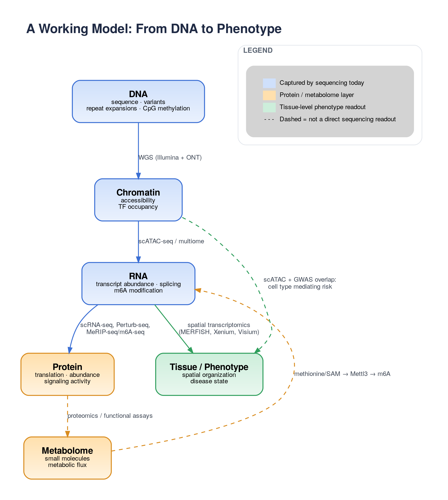

# Measuring Disease-Relevant Biology

Every sequencing technology we run in the lab is really an answer to the same question, asked at a different layer of biology: **what changed, where, and why does it matter for disease?** WGS tells you *why this person and not that one*. Methylation and chromatin assays tell you *what’s turned on or off*. RNA-seq tells you *what the cell is actually doing about it*. None of these answer the whole question alone. Mechanism discovery today is a multi-layer inference problem, not a single-assay one. Below is a working tour of the toolkit, some real examples of how it plays out from data to drug target, and where the whole stack tends to get stuck.

## The Sequencing Toolkit

**Whole genome sequencing: - Illumina (short-read) and Oxford Nanopore (long-read).** Illumina WGS produces per-individual variant calls (SNVs, indels, small structural variants) from short 100–150 bp fragments, typically rolled up into GWAS summary statistics namely effect size, p-value, allele frequency across millions of variants per cohort. This is the foundation for *association*, not mechanism: the great majority of GWAS hits land in non-coding regulatory sequence, commonly cited above 90%, so a locus alone doesn’t tell you the gene, the cell type, or the direction of effect. ONT long-read WGS complements this directly by sequencing native DNA molecules tens of kilobases long through a nanopore. That length is what lets it resolve structural variants and repeat expansions that short reads can’t span and, on the same molecule, call base modifications straight from the electrical signal.

**DNA methylation: -ONT.** Because Nanopore reads native DNA rather than a PCR-amplified library, it can call 5-methylcytosine directly from the raw signal, with no bisulfite conversion needed. The practical payoff is that a single ONT run can give you *both* a structural answer (how large is a repeat expansion) and an epigenetic one (what did that expansion do to methylation nearby and genome-wide) from the same molecule, rather than requiring a separate repeat-sizing assay and a separate bisulfite array.

**RNA methylation:- Illumina (MeRIP-seq / m6A-seq).** This measures the epitranscriptome, chemical marks written onto mRNA after transcription, the most abundant being N6-methyladenosine (m6A). The workflow immunoprecipitates m6A-modified RNA with an anti-m6A antibody, sequences both the IP and a matched input sample on Illumina, and calls methylation peaks as regions of IP enrichment over input, cross-checked against the expected DRACH motif. Because m6A can change an mRNA’s stability, splicing, or translation without touching its sequence or even its total expression, this assay is always paired with matched RNA-seq otherwise a translation effect and an expression effect are indistinguishable.

**Single-cell RNA-seq: -** Output is a sparse cell × gene count matrix typically 10,000–100,000+ cells, \~20,000 genes, with substantial dropout from transcript undersampling. After demultiplexing, ambient RNA correction, doublet removal, normalization, and batch integration, the real biological signal in a stimulated-vs-control design is often the differential network structure which genes are rewiring their regulatory relationships. Pooled Perturb-seq screens push this further, testing thousands of CRISPR perturbations in one experiment and shifting the computational problem from “did the gene change” to modeling tens of millions of cells against a combinatorial perturbation design without conflating perturbation effects with cell-cycle or batch effects.

**Single-cell multiomics:- 10x Genomics.** Paired RNA + ATAC from the same nucleus removes the need to computationally match cells across separate experiments. The output is two matrices sharing a barcode joint dimensionality reduction (e.g., weighted nearest neighbor integration) and peak-to-gene linkage become far better constrained than with unpaired, computationally integrated data. It’s still not a solved problem, a recent benchmark found that existing peak-gene linking scores had low concordance with fine-mapped eQTL data and underperformed a simple genomic-distance heuristic but paired measurement is the right substrate for the question.

| Technology | Typical scale per run | Primary noise source | Significant compute step |
| --- | --- | --- | --- |
| scRNA-seq | 5k–100k+ cells | Dropout, ambient RNA | Batch integration, DE testing |
| scATAC-seq | 5k–50k cells | Sparsity (2 allele copies), fragment noise | Peak calling, footprinting |
| Multiome (10x) | 5k–20k cells, paired | Both above, plus modality imbalance | Joint embedding, peak-gene linking |
| WGS — Illumina | 10³–10⁶ individuals | LD, population stratification | Fine-mapping, colocalization |
| WGS/methylation — ONT | Single genome, native molecules | Basecalling/modification-calling error | Repeat sizing, modification calling |
| RNA methylation (m6A-seq) | Bulk, paired IP/input | Antibody enrichment bias | Peak calling, motif validation |

## From Data to Mechanism to Drug Target

**Glioblastoma.** A 100-patient atlas integrating spatial transcriptomics, scRNA-seq, scATAC-seq, and patch-seq resolved two mesenchymal-like tumor states that transcriptomics alone couldn’t separate. One sitting in hypoxic niches next to monocyte-derived macrophages, the other perivascular, next to endothelial cells and pericytes. Spatial context turned a transcriptional cluster into a therapeutically distinct subtype plausibly needing different combination therapy. (Lin, Chen, et al., "Spatial and single-cell characterization of human glioblastoma tumor microenvironment reveals malignant cellular communities," Nature Neuroscience, 2026 — <https://www.nature.com/articles/s41593-026-02265-5>)

**22q11.2 deletion syndrome.** In a mouse model, embryonic thymic hypoplasia had been attributed vaguely to “mesenchymal dysfunction.” scRNA-seq resolved six mesenchymal subclusters and showed two chondrocyte-like and mesoderm-derived selectively expanded 17-fold and 3-fold in hypoplastic thymuses, driven by a Sox5/Sox6/Sox9 program producing excess collagen that physically stiffens the tissue. The same assay then served as the pharmacodynamic readout treating pregnant mice with minoxidil restored thymic growth and collapsed the aberrant chondrocyte expansion back toward normal, with trajectory inference confirming the differentiation path itself normalized. (Bhalla, Ahuja, Kumar, et al., "Minoxidil restores thymic growth in 22q11.2 deletion syndrome by limiting Sox9+ chondrocyte expansion," Journal of Human Immunity, 1(3):e20250143 <https://rupress.org/jhi/article/1/3/e20250143/278200>)

**Polycystic kidney disease.** MeRIP-seq showed the RNA methyltransferase Mettl3 is upregulated in mouse and human ADPKD kidneys, depositing m6A on pro-cystic transcripts *c-Myc* and *Avpr2* increasing their translation, not their transcript abundance, and activating cyst-promoting signaling. Tracing this further to methionine/SAM metabolism as the upstream driver, dietary methionine restriction or Mettl3 deletion slowed cyst growth in vivo a mechanism invisible to standard RNA-seq, since it lives in a reversible chemical mark rather than expression level. (Ramalingam et al., "A methionine-Mettl3-N6-methyladenosine axis promotes polycystic kidney disease," Cell Metabolism, 33(6):1234–1247.e7, 2021 <https://www.cell.com/cell-metabolism/fulltext/S1550-4131(21)00131-5>)

## Integrating the Layers and Where It Breaks

Put together, these assays trace one inference chain: genotype constrains regulatory potential, chromatin accessibility constrains which transcription factors can act, gene expression (and its epitranscriptomic modification) is the readout connecting both to phenotype, spatial context determines whether that readout even means the same thing in different neighborhoods. Integration in practice means colocalizing GWAS credible sets with cell-type-resolved chromatin, linking peaks to genes with paired multiome data, validating causal direction with eQTL/MR, and where the disease is structurally organized (tumors, fibrosis) anchoring all of it in spatial coordinates.

The bottlenecks are real and mostly statistical, not just computational. Peak-gene linking remains unsolved even with paired data. Existing methods underperform simple distance heuristics against fine-mapped eQTLs. Fine mapping is fundamentally limited by linkage disequilibrium, which smears signal across blocks and creates ambiguity that no amount of sequencing depth fixes. Each modality also has its own noise model (dropout in RNA, allele-limited sparsity in ATAC, segmentation and spot-mixing in spatial, population stratification in WGS), so naive integration risks conflating batch or platform effects with biology. And scale compounds all of this: a 100-patient spatial atlas or a 1.27-million-cell eQTL study is a data engineering problem before it’s a biological one.

## A Working Model: Where Each Assay Fits

    <em>Multi-omic layers and the sequencing technologies that connect them</em> 

Sequencing covers DNA, chromatin, and RNA (including its chemical modifications) comprehensively, and spatial platforms tie the RNA/chromatin readout back to tissue architecture. The protein and metabolome layers are the visible gap: NGS tells you what’s transcribed and how it’s modified, but not how much protein is made, how it’s folded or trafficked, or what metabolic flux results. That further requires proteomics and metabolomics, and the *methionine → Mettl3 → m6A* axis in ADPKD is a concrete example of the metabolome feeding back upstream into the RNA layer, which is exactly the kind of loop that a genomics-only pipeline will miss. Closing that gap pairing sequencing-based layers with proteomic and metabolomic readouts in the same samples or cells is the next integration problem, not a solved one.