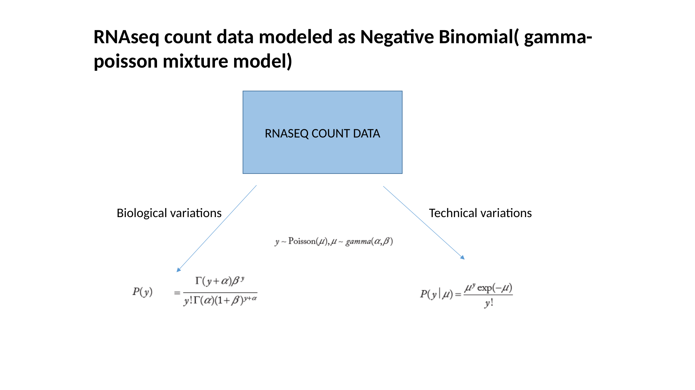
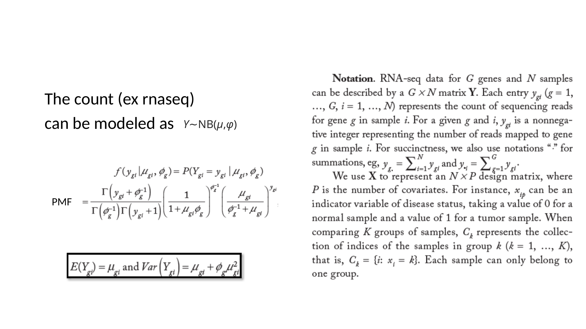
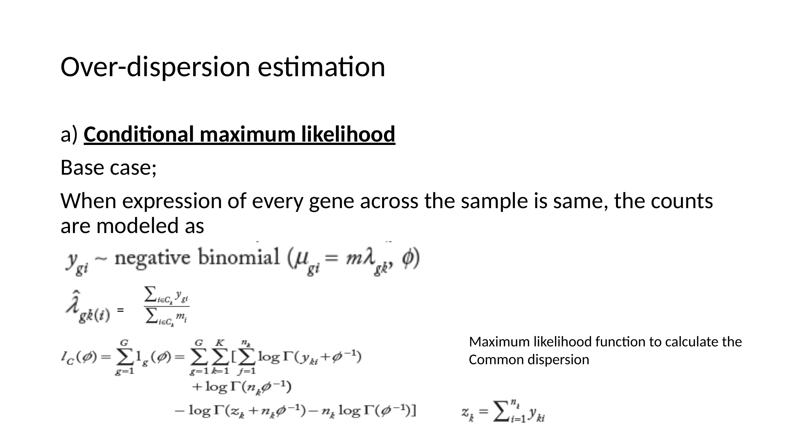
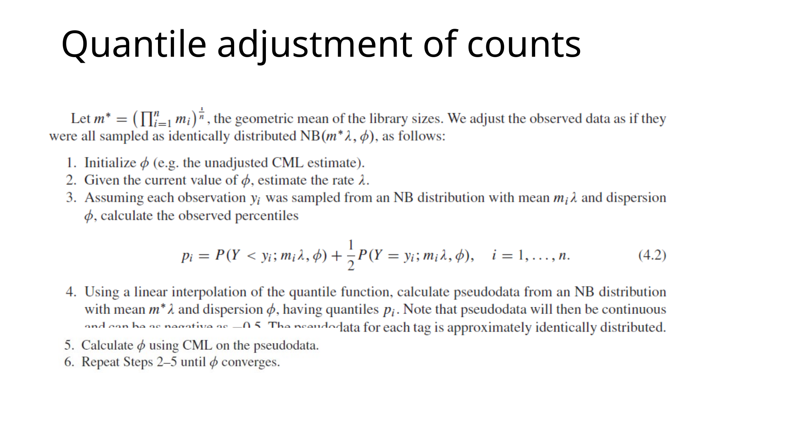
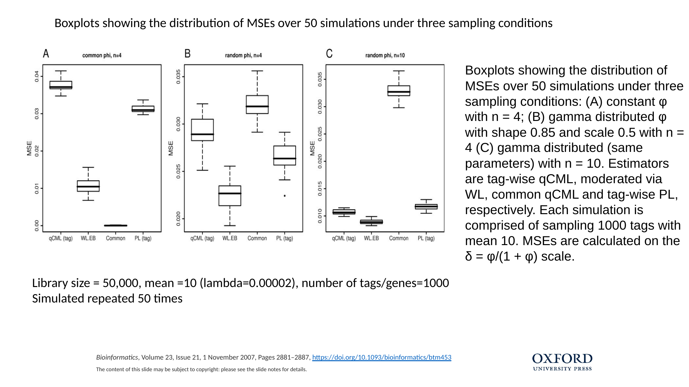

Negative binomial modeling for RNA-seq: from overdispersion to moderated
inference
================

- [Overview](#overview)
- [1. Why Poisson is insufficient for RNA-seq
  counts](#1-why-poisson-is-insufficient-for-rna-seq-counts)
- [2. A generative view: Poisson–Gamma mixing yields the
  NB](#2-a-generative-view-poissongamma-mixing-yields-the-nb)
- [3. The NB model used in RNA-seq: mean–dispersion
  parameterization](#3-the-nb-model-used-in-rna-seq-meandispersion-parameterization)
- [4. Dispersion estimation: the central problem for reliable
  inference](#4-dispersion-estimation-the-central-problem-for-reliable-inference)
  - [4.1 Conditional maximum likelihood for a common
    dispersion](#41-conditional-maximum-likelihood-for-a-common-dispersion)
  - [4.2 Quantile-adjusted CML (qCML) for unequal library
    sizes](#42-quantile-adjusted-cml-qcml-for-unequal-library-sizes)
  - [4.3 Moderated gene-wise dispersion via weighted conditional
    likelihood
    (WL)](#43-moderated-gene-wise-dispersion-via-weighted-conditional-likelihood-wl)
  - [4.4 Simulation evidence (MSE
    comparisons)](#44-simulation-evidence-mse-comparisons)
- [5. How this maps to edgeR (with R
  code)](#5-how-this-maps-to-edger-with-r-code)
- [References](#references)

## Overview

High-throughput sequencing produces **integer counts** (reads or UMIs)
per gene and sample. A Poisson model is often used as a first
approximation, but it enforces an equality between the mean and variance
that is typically violated in RNA-seq. Real data commonly exhibit
**overdispersion** (variance \> mean) because variability arises from
both **technical** and **biological** sources.

A standard remedy is to model counts using a **negative binomial (NB)**
distribution and to invest statistical effort into robust estimation of
the **dispersion** parameter. This post summarizes the NB framework and
the key dispersion ideas that underpin widely used differential
expression tools such as **edgeR** (Robinson & Smyth, 2007; Robinson &
Smyth, 2008; Robinson, McCarthy & Smyth, 2010).

------------------------------------------------------------------------

## 1. Why Poisson is insufficient for RNA-seq counts

For a Poisson random variable, the mean and variance are equal:

$$
Y \sim \text{Poisson}(\mu)
\quad\Rightarrow\quad
\mathbb{E}[Y] = \mu,\;
\mathrm{Var}(Y) = \mu.
$$

RNA-seq counts frequently show **extra-Poisson variation**, i.e.,

$$
\mathrm{Var}(Y) > \mathbb{E}[Y],
$$

which motivates a model class that separates the mean from the variance.

------------------------------------------------------------------------

## 2. A generative view: Poisson–Gamma mixing yields the NB

A convenient interpretation of the negative binomial is as a
**Poisson–Gamma mixture**. Suppose

$$
Y \mid \lambda \sim \text{Poisson}(\lambda),
\qquad
\lambda \sim \text{Gamma}(\alpha, \beta),
$$

then marginally $Y$ follows a negative binomial distribution. This
mixing construction introduces sample-to-sample variability in the
Poisson rate and produces overdispersion.



**Figure 1.** Poisson–Gamma mixture view and intuition for
overdispersion.

------------------------------------------------------------------------

## 3. The NB model used in RNA-seq: mean–dispersion parameterization

A common parameterization for RNA-seq models gene $g$ in sample $i$ as

$$
Y_{gi} \sim \text{NB}(\mu_{gi}, \phi_g),
$$

where $\mu_{gi}$ is the mean and $\phi_g$ is the dispersion for gene
$g$.

One (mean–dispersion) form of the PMF is

$$
\Pr(Y_{gi}=y)=
\frac{\Gamma\!\left(y+\phi_g^{-1}\right)}
{\Gamma\!\left(\phi_g^{-1}\right)\,\Gamma(y+1)}
\left(\frac{1}{1+\mu_{gi}\phi_g}\right)^{\phi_g^{-1}}
\left(\frac{\mu_{gi}\phi_g}{1+\mu_{gi}\phi_g}\right)^y,
\qquad y=0,1,2,\dots
$$

with moments

$$
\mathbb{E}[Y_{gi}] = \mu_{gi},
\qquad
\mathrm{Var}(Y_{gi}) = \mu_{gi} + \phi_g\,\mu_{gi}^2.
$$

This variance form highlights the key advantage: when $\phi_g \to 0$,
the NB approaches the Poisson; as $\phi_g$ increases, variance grows
quadratically with the mean.



**Figure 2.** Negative binomial PMF and the mean–variance relationship.

------------------------------------------------------------------------

## 4. Dispersion estimation: the central problem for reliable inference

Once the likelihood is fixed, much of the practical performance in
differential expression depends on estimating dispersion
accurately—especially with few replicates. Early contributions
emphasized (i) **conditional likelihood** to remove nuisance mean
parameters and (ii) **moderation** (shrinkage) to stabilize gene-wise
dispersion estimates (Robinson & Smyth, 2007).

### 4.1 Conditional maximum likelihood for a common dispersion

A baseline approach assumes a shared dispersion $\phi$ across genes.
Estimation can proceed via **conditional maximum likelihood (CML)** by
conditioning on totals to remove gene-specific mean parameters, and then
maximizing with respect to $\phi$.



**Figure 3.** Schematic for common-dispersion estimation using
conditional likelihood.

### 4.2 Quantile-adjusted CML (qCML) for unequal library sizes

When library sizes differ substantially, counts are not identically
distributed across samples.The observed counts are adjusted up or down
depending on whether the corresponding library size are above or below
the geometric mean of the library size.A quantile adjusted pseudo data
is created which is then used to better estimate the dispersion.(See
below an excerpt from the paper
<https://academic.oup.com/biostatistics/article/9/2/321/353777>)



**Figure 4.** Quantile adjustment to address unequal library sizes.

### 4.3 Moderated gene-wise dispersion via weighted conditional likelihood (WL)

As sample sizes increase, estimating gene-wise dispersion $\phi_g$
becomes feasible, but raw gene-wise estimates can be unstable. A
principled compromise is to **shrink** gene-wise dispersions toward a
consensus by maximizing a **weighted conditional log-likelihood**
(Robinson & Smyth, 2007):

$$
\mathrm{WL}(\phi_g) = \ell_g(\phi_g) + \alpha\,\ell_C(\phi_g),
$$

where $\ell_g$ is the conditional log-likelihood for gene $g$, $\ell_C$
is the common conditional log-likelihood, and $\alpha$ controls the
strength of shrinkage (larger $\alpha$ implies stronger moderation).

### 4.4 Simulation evidence (MSE comparisons)

Simulation experiments reported in this literature evaluate dispersion
estimators under different regimes, often using the transformed scale

$$
\delta = \frac{\phi}{1+\phi}
$$

for mean-squared error (MSE) calculations. A recurring observation is
that moderation can improve MSE relative to purely gene-wise estimation
in small samples while preserving flexibility when dispersions vary
across genes (Robinson & Smyth, 2007; Robinson & Smyth, 2008).



**Figure 5.** Boxplots of MSE distributions across simulation settings,
comparing common, gene-wise, and moderated estimators.

------------------------------------------------------------------------

## 5. How this maps to edgeR (with R code)

edgeR implements NB models for count data, estimates dispersions with
information sharing across genes, and performs differential expression
testing using exact or GLM-based procedures (Robinson, McCarthy & Smyth,
2010). Below is a standard analysis template.

> The code below is provided as a **drop-in starting point**. It is
> marked `eval=FALSE` so this article knits without requiring data
> files.

``` r
# edgeR differential expression (NB + moderated dispersions)

library(edgeR)

# counts: matrix of raw counts (genes x samples)
# group: factor indicating experimental condition per sample
# Example:
# counts <- read.delim("counts.tsv", row.names = 1, check.names = FALSE)
# group  <- factor(c("Control","Control","Treat","Treat"))

y <- DGEList(counts = counts, group = group)

# 1) Library size normalization (TMM by default)
y <- calcNormFactors(y)

# Optional: filter lowly-expressed genes (recommended)
keep <- filterByExpr(y, group = group)
y <- y[keep, , keep.lib.sizes = FALSE]

# 2) Design matrix (for GLM workflows)
design <- model.matrix(~ group)

# 3) Estimate dispersions (common/trended/tagwise with EB-style moderation)
y <- estimateDisp(y, design)

# --- Option A: Two-group exact test (classic edgeR; 2 groups) ---
# et <- exactTest(y)
# tt <- topTags(et, n = 20)
# print(tt)

# --- Option B: GLM quasi-likelihood workflow (recommended for general designs) ---
fit <- glmQLFit(y, design)
qlf <- glmQLFTest(fit, coef = 2)     # coef=2 corresponds to 'groupTreat' if Control is baseline
tt  <- topTags(qlf, n = 20)
print(tt)

# 4) Write results
res <- as.data.frame(tt)
write.csv(res, file = "edgeR_top_results.csv", row.names = TRUE)
```

If you specifically want to make the common vs tagwise dispersion
estimation steps explicit:

``` r
library(edgeR)

y <- DGEList(counts = counts, group = group)
y <- calcNormFactors(y)

y <- estimateCommonDisp(y)
y <- estimateTagwiseDisp(y)

et <- exactTest(y)
topTags(et)
```

------------------------------------------------------------------------

## References

1.  Robinson, M. D., & Smyth, G. K. (2007). *Moderated statistical tests
    for assessing differences in tag abundance.* **Bioinformatics**,
    23(21), 2881–2887. <https://doi.org/10.1093/bioinformatics/btm453>

2.  Robinson, M. D., & Smyth, G. K. (2008). *Small-sample estimation of
    negative binomial dispersion, with applications to SAGE data.*
    **Biostatistics**, 9(2), 321–332.
    <https://doi.org/10.1093/biostatistics/kxm030>

3.  Robinson, M. D., McCarthy, D. J., & Smyth, G. K. (2010). *edgeR: a
    Bioconductor package for differential expression analysis of digital
    gene expression data.* **Bioinformatics**, 26(1), 139–140.
    <https://doi.org/10.1093/bioinformatics/btp616>
